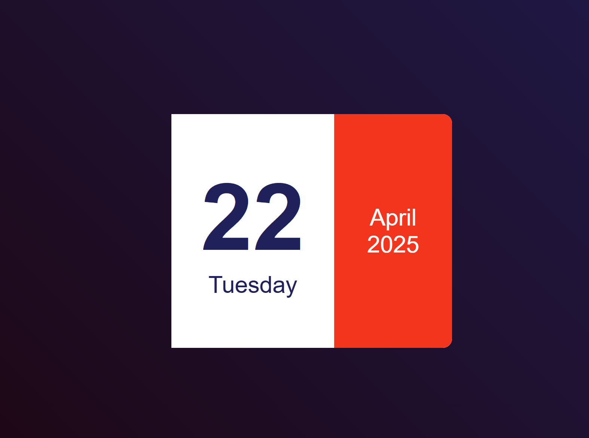

# Mini Calendar

A simple and responsive mini calendar built with HTML, CSS, and JavaScript.

## Features

- Displays the current month and year.
- Highlights the current date.
- Allows navigation between months.
- Fully responsive design.

## Project Structure

## Screenshot

